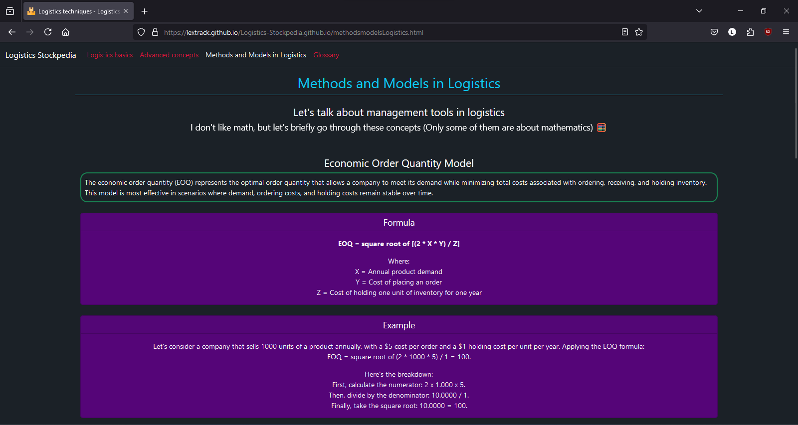

# Logistics Stockpedia

It's an informative application developed with HTML, CSS, and JavaScript, incorporating several concepts and details about logistics.

**You can use it <a href="https://lextrack.github.io/Logistics-Stockpedia.github.io/" target="_blank">HERE</a>**

## License

This project is licensed under the MIT License. See the LICENSE file for details.
