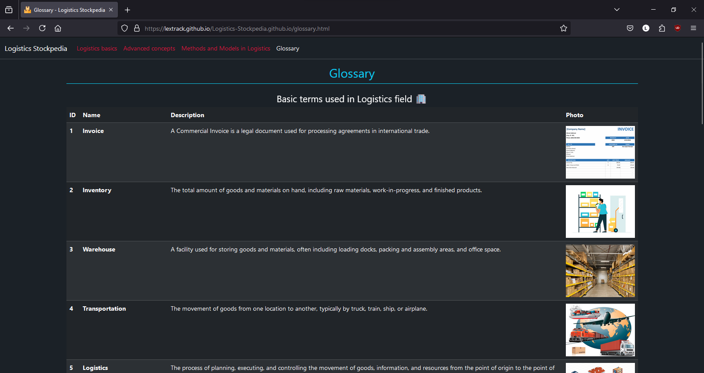

# Logistics Stockpedia

At the moment, I'm in the process of developing a straightforward CRUD application using JavaScript. As I work on this project, I'm also integrating some of the fundamental concepts and knowledge about logistics that I'm currently acquiring in university. These are notes on the most important aspects of the logistics industry.

**You can use it <a href="https://lextrack.github.io/Logistics-Stockpedia.github.io/" target="_blank">HERE</a>**

